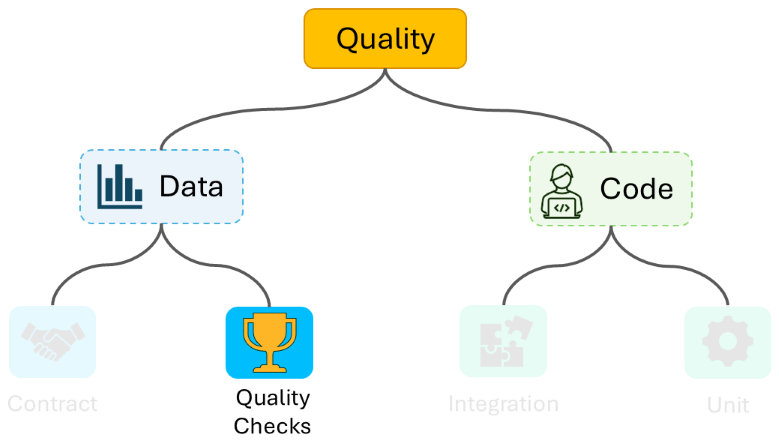

# Data Checks

## Content

This catalog contain sample idea on how to apply SQL data checks within Databricks platform. 
### Files

- **data_checks_cfg** - configuration of data_checks
- **data_checks.py** - Python module with methods interacting with data checks
- **pipeline.py** - Databricks notebook to use data_checks
- **readme.md** - this file

## Hot to use it

This code is intended to be run in Databricks workspace in an interactive cluster. You need to just run the pipeline.py notebook.