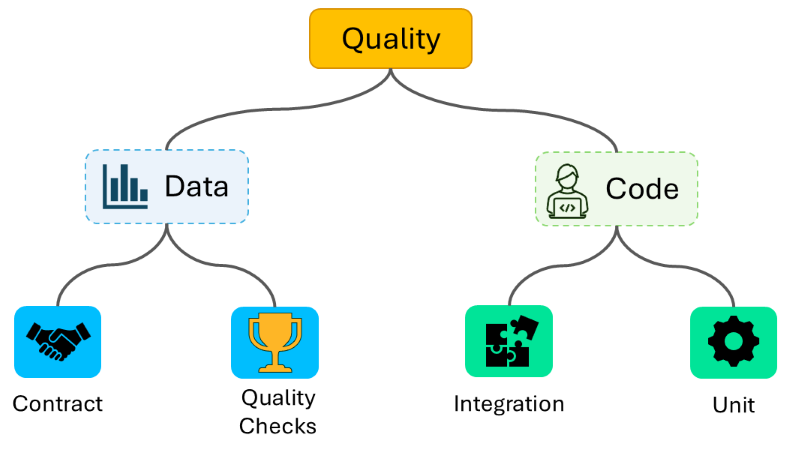

# Databricks Testing Solution - Demo

## Content

This reposiotory contains samples on how can automated testing be performed on analytical platform based on Spark, especially Databricks.
You can find multiple tests approaches, each withing it's own catalog:

- **data_checks** - sample SQL based data checks to validate quality of data
- **data_contract** - data contract solution comparing source raw files with schema of target Delta Lake table
- **integration_tests** - testing Databricks notebooks as a whole
- **unit_tests** - test each module, function as in *traditional* software testing

## How to use

Each catalog lives as a whole component which can be run either in Databricks or locally. In each of them you'll find 
a readme.md file which guides through the usage. The whole repo is under MIT license, thus feel free to use it even in commrecial solutions. Just please leave a star :pleading_face: